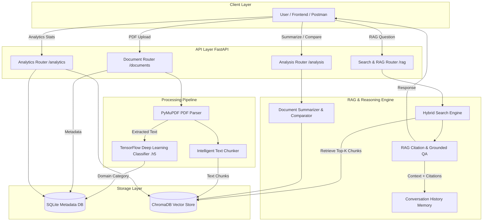

# AI Research & Knowledge Assistant

An enterprise-ready, production-grade AI Research & Knowledge Assistant backend application designed to ingest, process, classify, analyze, and query unstructured research papers and technical documents.

Featuring **Retrieval-Augmented Generation (RAG)** with page-level citations, **TensorFlow Document Classification**, multi-mode search (Semantic, Keyword, Hybrid), multi-document comparison/summarization, session-based conversational memory, and real-time knowledge base analytics via REST APIs.

---

## 🏗️ Architecture Diagram



---

## ✨ Core Features

1. **Document Management & Automated Ingestion**:
   - Upload, store, list, delete, and reprocess multi-page PDF documents.
   - Preserves page-level metadata (`doc_id`, `file_name`, `page_number`, `upload_timestamp`, `total_pages`, `total_chunks`, `processing_status`).

2. **TensorFlow Deep Learning Document Classifier**:
   - Neural network model built with Keras (`TextVectorization`, `Embedding`, `GlobalAveragePooling1D`, `Dense` with `Softmax`).
   - Automatically categorizes newly uploaded PDFs into tech domains (`Artificial Intelligence`, `Machine Learning`, `Computer Vision`, `Natural Language Processing`, `Robotics`, `Cyber Security`, `Cloud Computing`).

3. **Multi-Mode Search Engine**:
   - **Semantic Search**: Dense vector similarity using HuggingFace `sentence-transformers/all-MiniLM-L6-v2`.
   - **Keyword Search**: Term matching and frequency relevance scoring.
   - **Hybrid Search**: Combines dense semantic scores with sparse keyword matches for balanced recall and precision.

4. **Grounded RAG QA with Page-Level Citations**:
   - Answers domain queries strictly grounded in retrieved document context.
   - Outputs final answer, retrieved context snippets, confidence scores, and explicit file & page citations (`Source: Paper.pdf (Page 2)`).
   - Strict fallback ("I cannot determine the answer from the provided documents") if context coverage is insufficient.

5. **Conversational Memory**:
   - Maintains session context across user turns (`ConversationBufferMemory` / database persistence).
   - Automatically resolves follow-up pronouns (e.g. "What are its limitations?", "Summarize it").

6. **Multi-Document Comparison & Summarization**:
   - Generates 4-tier structured summaries (`Executive Summary`, `Technical Summary`, `Bullet Points`, `Key Takeaways`).
   - Multi-document comparison evaluating methodologies, pros/cons, similarities, differences, and implementation approaches.

7. **System Analytics & Usage Tracking**:
   - Endpoint `/analytics/stats` tracking total documents, processed chunks, total embeddings, domain category breakdown, most-queried documents, and total questions answered.

---

## 🛠️ Technology Stack

- **Backend Framework**: Python 3.10+, FastAPI, Uvicorn, Pydantic v2
- **PDF Extraction**: PyMuPDF (`fitz`)
- **Machine Learning**: TensorFlow 2.x, Keras, Scikit-Learn
- **Vector Database**: ChromaDB (persistent vector store)
- **Embeddings**: SentenceTransformers (`all-MiniLM-L6-v2`)
- **Database & ORM**: SQLite, SQLAlchemy 2.0
- **Testing**: PyTest

---

## 🚀 Setup & Installation Instructions

### 1. Clone & Navigate to Repository
```bash
git clone https://github.com/your-username/ai-research-assistant.git
cd ai-research-assistant
```

### 2. Create Virtual Environment & Install Dependencies
```bash
# Create virtual environment
python -m venv venv

# Activate environment
# On Windows:
venv\Scripts\activate
# On Linux/macOS:
source venv/bin/activate

# Install required packages
pip install -r requirements.txt
```

### 3. Environment Configuration
Copy `.env.example` to `.env`:
```bash
cp .env.example .env
```
Default configuration values in `.env`:
```env
APP_NAME="AI Research & Knowledge Assistant"
DEBUG=True
DATABASE_URL="sqlite:///./data/assistant.db"
VECTOR_DB_DIR="./data/vector_db"
MODEL_PATH="./models/tf_classifier.h5"
TOKENIZER_PATH="./models/tokenizer.pickle"
EMBEDDING_MODEL="sentence-transformers/all-MiniLM-L6-v2"
OPENAI_API_KEY="" # Optional: Add key if you want OpenAI LLM synthesis
```

### 4. Create Sample Data & Train TF Model (Optional manual trigger)
```bash
python data/create_sample_pdfs.py
python src/ml/train_classifier.py
```

### 5. Run FastAPI Application Server
```bash
uvicorn main.py:app --reload --port 8000
```

Access Swagger Interactive API Documentation at:
**`http://localhost:8000/docs`**

---

## 🧪 Running Automated Tests

Run the test suite with PyTest:
```bash
pytest tests/
```

---

## 📡 REST API Endpoint Documentation

| Category | HTTP Method | Endpoint | Description |
| :--- | :--- | :--- | :--- |
| **Health** | `GET` | `/` | System health check and API details |
| **Documents** | `POST` | `/documents/upload` | Upload PDF file and trigger background processing |
| | `GET` | `/documents` | List all uploaded documents with metadata |
| | `GET` | `/documents/{doc_id}` | Retrieve specific document metadata |
| | `DELETE` | `/documents/{doc_id}` | Delete PDF file, DB record, and vector embeddings |
| | `POST` | `/documents/{doc_id}/reprocess` | Re-parse, re-classify, and re-index PDF document |
| **Search & RAG**| `POST` | `/search/semantic` | Vector cosine similarity search |
| | `POST` | `/search/hybrid` | Combined dense vector + sparse keyword search |
| | `POST` | `/rag/ask` | Grounded RAG QA with page-level citations & session memory |
| **Analysis & ML**| `POST` | `/analysis/summarize` | Executive, Technical, Bullet Points & Takeaways summary |
| | `POST` | `/analysis/compare` | Compare methodologies, pros/cons across multiple PDFs |
| | `POST` | `/analysis/classify` | Predict tech category of text via TensorFlow model |
| **Analytics** | `GET` | `/analytics/stats` | System stats, total chunks, category distribution, top queries |

---

## 💡 Key Design Decisions & Assumptions

1. **Page-Aware Text Chunking**: Chunk size is set to ~900 characters with 120 character overlap, preserving exact page numbers so every retrieved chunk can produce explicit citations (`Page N`).
2. **Local Open-Source Embeddings**: Uses `sentence-transformers/all-MiniLM-L6-v2` locally so vector search operates at high performance without external network dependency or API costs.
3. **TensorFlow Keras Deep Classifier**: Trained on tech domain dataset to auto-categorize uploaded PDFs into predefined categories upon upload.
4. **Conversational Memory Handling**: Chat history is persisted in SQLite per session ID, appending past context to resolve multi-turn pronoun references ("its", "this paper").
5. **Strict Grounded Fallback**: If retrieved vector similarity score falls below threshold, the system returns `"I cannot determine the answer from the provided documents"` to prevent hallucinations.

---

## 🔮 Future Roadmap & Enhancements

- Multi-modal support (Extracting images and table structures from PDFs using OCR).
- Reranking models (Cross-encoder reranking for fine-grained retrieval precision).
- User authentication & role-based multi-tenant access control (JWT auth).
- Containerization with Docker and Kubernetes deployment manifests.
